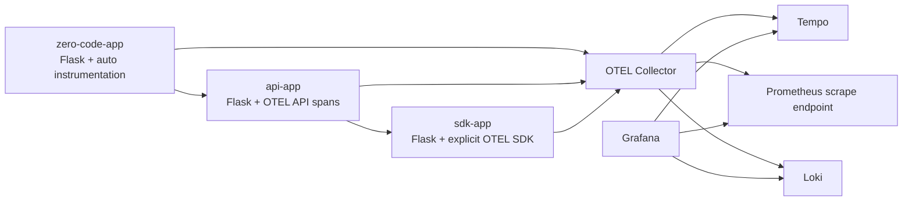
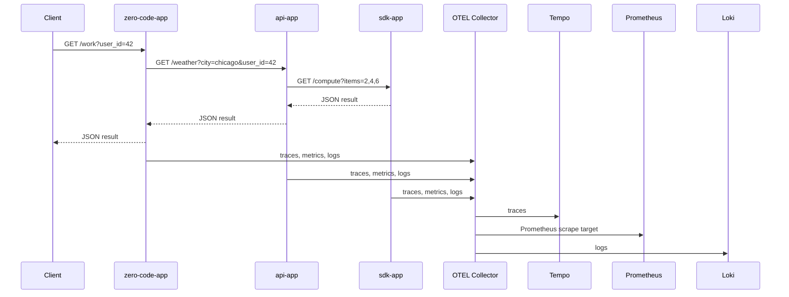

# Architecture

## Overview

The stack uses a single OTEL Collector as the aggregation point for traces, metrics, and logs from three Python services.

## Request Path

## Design Notes

- The zero-code service proves that useful telemetry can be collected without modifying application code.
- The API service adds business spans to improve trace readability.
- The SDK service demonstrates precise control over metrics, logs, and trace export.
- Grafana data sources are provisioned at startup, so no manual setup is required.

